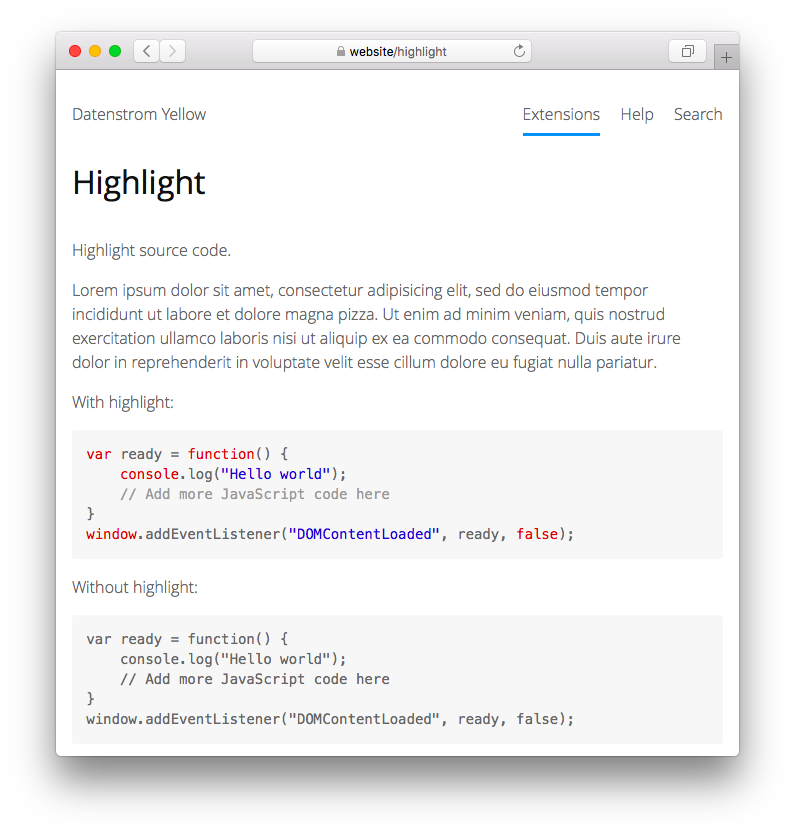

<p align="right"><a href="README-de.md">Deutsch</a> &nbsp; <a href="README.md">English</a> &nbsp; <a href="README-sv.md">Svenska</a></p>

# Highlight 0.8.17

Quellcode hervorheben.

<p align="center"></p>

## Wie man eine Erweiterung installiert

[ZIP-Datei herunterladen](https://github.com/annaesvensson/yellow-highlight/archive/refs/heads/main.zip) und in dein `system/extensions`-Verzeichnis kopieren. [Weitere Informationen zu Erweiterungen](https://github.com/annaesvensson/yellow-update/tree/main/README-de.md).

## Wie man Quellcode hervorhebt

Wickle Codeblöcke in \`\`\` ein und fügen eine Sprachidentifizierung hinzu.

Die folgenden Programmiersprachen sind enthalten: C, CPP, CSS, HTML, JavaScript, JSON, Lua, PHP, Python, YAML. Du kannst weitere [Sprachdateien](https://github.com/scrivo/highlight.php/tree/master/src/Highlight/languages) herunterladen, umbenennen und in dein `system/extensions`-Verzeichnis kopieren.

## Beispiele

Hervorhebung von JavaScript-Quellcode:

    ``` javascript
    var ready = function() 
    {
        console.log("Hello world");
        // Add more JavaScript code here
    }
    window.addEventListener("DOMContentLoaded", ready, false);
    ```

Hervorhebung von HTML-Quellcode, mit und ohne Zeilennummer:
    
    ``` html {.with-line-number}
    <body>
    <p>Hello world!</p>
    </body>
    ```

    ``` html {.without-line-number}
    <body>
    <p>Hello world!</p>
    </body>
    ```

## Einstellungen

Die folgenden Einstellungen können in der Datei `system/extensions/yellow-system.ini` vorgenommen werden:

`HighlightLineNumber` = Zeilennummer anzeigen, 1 oder 0  
`HighlightAutodetectLanguages` = Sprachen zur automatischen Erkennung, durch Komma getrennt  

## Danksagung

Diese Erweiterung enthält [highlight.php 9.18.1.10](https://github.com/scrivo/highlight.php) von Ivan Sagalaev und Geert Bergman. Danke für die gute Arbeit.

## Entwickler

Anna Svensson. [Hilfe finden](https://datenstrom.se/de/yellow/help/).
