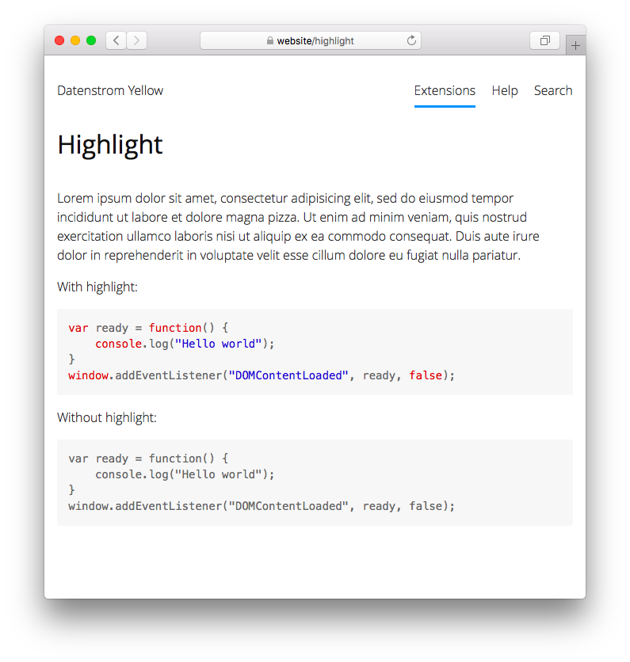

<p align="right"><a href="readme-de.md">Deutsch</a> &nbsp; <a href="readme.md">English</a> &nbsp; <a href="readme-sv.md">Svenska</a></p>

# Highlight 0.9.2

Highlight code blocks.

<p align="center"></p>

## How to install an extension

[Download ZIP file](https://github.com/annaesvensson/yellow-highlight/archive/refs/heads/main.zip) and copy it into your `system/extensions` folder. [Learn more about extensions](https://github.com/annaesvensson/yellow-update).

## How to highlight a code block

Wrap your code block in \`\`\` and add a language identifier.

The following programming languages are included: C, CPP, CSS, HTML, JavaScript, JSON, Lua, PHP, Python, YAML. You can download more [language files](https://github.com/scrivo/highlight.php/tree/master/src/Highlight/languages), rename and copy them into your `system/workers` folder.

## Examples

Highlighting of JavaScript code:

    ``` javascript
    var ready = function() 
    {
        console.log("Hello world");
        // Add more JavaScript code here
    }
    window.addEventListener("DOMContentLoaded", ready, false);
    ```

Highlighting of HTML code, with and without line number:
    
    ``` html {.with-line-number}
    <body>
    <p>Hello world!</p>
    </body>
    ```

    ``` html {.without-line-number}
    <body>
    <p>Hello world!</p>
    </body>
    ```

## Settings

The following settings can be configured in file `system/extensions/yellow-system.ini`:

`HighlightLineNumber` = show line number, 1 or 0  
`HighlightAutodetectLanguages` = languages for automatic detection, comma separated  

## Acknowledgements

This extension includes [highlight.php 9.18.1.10](https://github.com/scrivo/highlight.php) by Ivan Sagalaev and Geert Bergman. Thank you for the good work.

## Developer

Anna Svensson. [Get help](https://datenstrom.se/yellow/help/).
